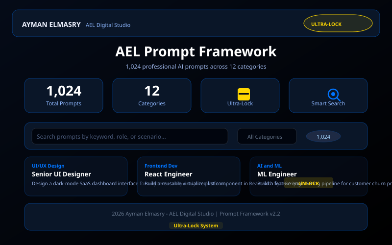

# AEL | Prompt Framework — 50 Professional AI Prompts

> **🚨 ARCHIVED** — This project has been merged into the [AEL 1000+ AI Prompts Library](https://github.com/aymanelmasryael/ael-1000-prompts-library) as Batch 11. This repository is kept as a redirect only and is no longer actively maintained.

> **50 professional AI prompts** with smart search, generation engine, multi-format export, and an interactive UI component library.  
> Built by Ayman Elmasry — AEL Digital Studio.

---

## Preview



---

## Table of Contents

- [Features](#features)
- [How It Works](#how-it-works)
- [Project Structure](#project-structure)
- [Getting Started](#getting-started)
- [Usage](#usage)
- [Export Formats](#export-formats)
- [Technical Details](#technical-details)
- [Credits](#credits)

---

## Features

- **50 professional prompts** — covering UI/UX Design, Frontend Dev, Backend Dev, AI & ML, Data Science, DevOps, Mobile, Security, Product, Writing, Marketing, and Education
- **12 categories** — organized and color-coded for quick browsing
- **Smart search** — real-time filtering by keyword, role, or scenario
- **Generation Engine** — AEL Prompt Generation Engine for dynamic prompt creation
- **Multi-format export** — JSON, CSV, TXT — export filtered or full dataset
- **One-click copy** — copy any prompt to clipboard instantly
- **Glassmorphism UI** — dark theme with blue (#0074FF) accents
- **Fully client-side** — no server, no database, no build step

---

## How It Works

### Prompt Architecture

Each prompt is a structured entry with role, category, and full prompt text. The library is organized into 12 professional categories.

### Search Engine

- Real-time filtering as the user types
- Matches against role, category, and prompt text (case-insensitive)
- Instant results with zero latency

### Generation Engine

The AEL Prompt Generation Engine dynamically creates new prompts by combining role templates with context parameters:
1. Select a professional role or category
2. Define the context and requirements
3. The engine generates a tailored prompt with specific instructions, constraints, and output format
4. Copy the generated prompt for immediate use

---

## Project Structure

```
ael-prompt-framework/
├── index.html                    # HTML5 semantic structure
├── ael_prompt_framework.css      # All styles (glassmorphism, dark theme)
├── ael_prompt_framework.js       # Full JS engine (search, generation, export, UI)
├── screenshot.svg                # Project preview image
├── ael-logo.svg                  # AEL brand logo
├── .gitignore
└── README.md
```

This separation follows modern web best practices:
- **HTML5** — semantic elements with tab-based navigation
- **CSS3** — custom properties for theming, Flexbox/Grid layout
- **Vanilla JS (ES2020+)** — zero dependencies, runs in any modern browser

---

## Getting Started

### Run Locally

```bash
git clone https://github.com/aymanelmasryael/ael-prompt-framework.git
cd ael-prompt-framework
open index.html
```

Or simply open `index.html` in any modern browser — no server required.

### Prerequisites

- A modern web browser (Chrome, Firefox, Safari, Edge)
- Internet connection on first load (for Font Awesome CDN)
- No build tools, no package managers, no server

---

## Usage

### Browse Prompts
- Open `index.html` and browse the Library tab
- Use the category filter to narrow by profession
- Scroll through prompt cards with role badges and descriptions

### Search
- Type in the search box to filter prompts in real time
- Matches against role, category, and prompt text

### Generate Prompts
- Navigate to the **Generation** tab
- Configure role, context, and requirements
- Click **Generate** to create a new prompt
- Copy or save the result

### Copy a Prompt
- Click the copy icon on any prompt card
- Prompt text is copied to clipboard instantly

### Export
- Use the export buttons to download filtered or full dataset

---

## Export Formats

| Button | Format | Filename |
|--------|--------|----------|
| JSON | JSON array | `ael_prompts.json` |
| CSV | RFC 4180 CSV | `ael_prompts.csv` |
| TXT | Numbered text | `ael_prompts.txt` |

> **Note:** Exports reflect the current filtered/search result by default.

---

## Technical Details

| Aspect | Detail |
|--------|--------|
| Architecture | Static site (HTML5 + CSS3 + JS) |
| JavaScript | Vanilla ES2020+, zero dependencies |
| CSS | Custom properties for theming |
| Icons | Font Awesome 6.5.0 (CDN) |
| Browser support | Chrome, Firefox, Safari, Edge (modern versions) |
| Offline | Works locally via `file://` |

---

## Credits

**Created by:** Ayman Elmasry — AEL Digital Studio  
**Website:** [aymanelmasry.com](https://aymanelmasry.com)  
**Email:** [info@aymanelmasry.com](mailto:info@aymanelmasry.com)  
**License:** © 2026 Ayman Elmasry — AEL Digital Studio. All rights reserved.

### Connect

[LinkedIn](https://linkedin.com/in/aymanelmasryael) · [Instagram](https://instagram.com/aymanelmasryael) · [X](https://x.com/aymanelmasryael) · [CodePen](https://codepen.io/aymanelmasryael) · [GitHub](https://github.com/aymanelmasryael) · [Behance](https://behance.net/aymanelmasryael)

---

*AEL Prompt IP System v1.0 — Sovereign Identity Block*
